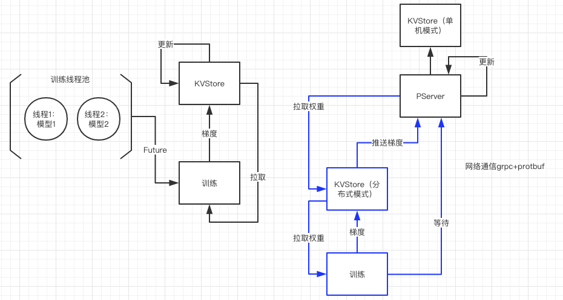
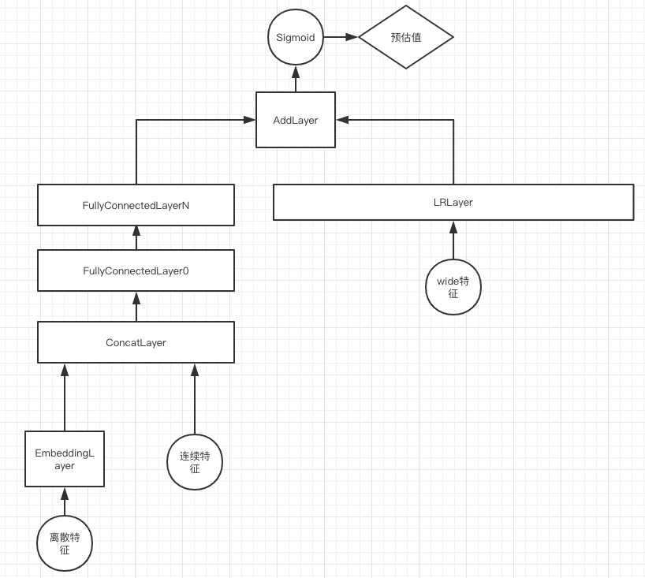
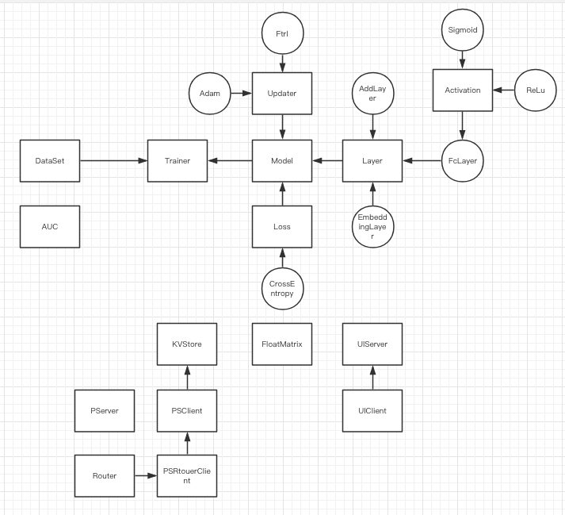
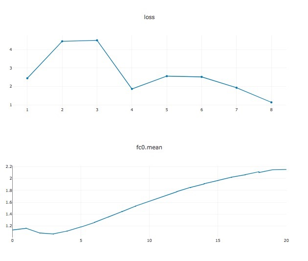

# 参数服务器

    本项目使用非常少的代码编写了深度学习训练的全过程，有完整的结构，通过面向对象的封装，在算法上有一定扩展性，不仅支持单机模式还支持分布式模式

    使用java实现的dnn训练框架，底层矩阵库使用Jblas(https://github.com/mikiobraun/jblas)，参数服务器使用Grpc+protobuf，ui方面使用ploty.js+nanohttpd

    支持单机多CPU训练

    支持分布式训练，多worker，多ps自定义负载均衡
    
    支持同步更新和异步更新
    
    支持二分类和多分类

    实现embdding+全链接模型
    
    实现Wide And Deep模型
    
    实现卷积+池化+全链接模型
    
    支持训练数据，测试数据异步读取，自定义parser
    
    UI Server可视化图表
    
## 例子
    
    运行 CTR.java 点击率预估例子，test auc在0.71左右
    
    运行 Mnist.java 手写输入例子，正确率在0.92左右。如果从网上下载全量的mnist数据，正确率在0.98左右
    
    运行 CnnMnist.java 使用Cnn实现的手写输入识别
    
    注意，根据运行的cpu core数量不同，结果略有差异，需要略微调整mini batch数量尽快收敛
    
    Jblas linux需要安装libgfortran3

## 架构

    单机多CPU是使用多个相同的模型，提交到线程池，各自做训练，然后再主线程等待所有线程执行完毕对梯度进行更新

    多机与单机的不同在于KVStore是分布式实现，获取参数都是从PS获取，多机还有一点是需要调用参数服务器的barrier测是否需要阻塞
    

## 模型结构

    
    以wide and deep模型为例子，展示了如何组合layer构造模型

## 代码结构

## 可视化

    需要启动UiServer，访问 localhost:8888 图表会随着训练过程动态刷新
    
    使用UiClient::plot() 方法可以在训练中进行打点，打点信息会异步的发送给UiServer，不会阻塞训练过程

## 包概括

- __activations__

    激活函数，目前支持Sigmoid，Relu，LeakyRelu，Softmax

    forward，输入x，输出y

    backward，dy是前向累计梯度，preY一般没什么用，Y比较有用，因为sigmoid的导数是通过y计算出来的y（1-y）

- __context__

    主要是配置参数，init方法通过java的-D参数初始化

    - -Dmode=dist 分布式模式 -Dmode=standalone 单机模式

    - -DnTermDump=20 训练20次打印train auc和预估值实际值

    - -Dthread=4 单机多线程训练使用的线程数量，默认为cpu核心数，单机多线程训练会同步对梯度做平均
    
    - -DisPs 分布式模式下当前节点是否是参数服务器
    
    - -DisAsync 分布式模式下是否异步更新
    
    - -DworkerNum 分布式模式下worker数量
    
    - -DpsPort 参数服务器端口号
    
    - -DpsHost 参数服务器端host地址
    
    - -DpsAddrs 参数服务器集群，eg:localhost:2081,localhost:2082
    
    - -DuiPort 可视化服务器端口号
        
    - -DuiHost 可视化服务器host地址

- __data__

    DataSet 数据集，next读取一批数据，hasNext查看是否还有数据，用户需要实现其parseFeature方法
    
    DataSet 可以异步多线程填充训练数据到数据队列中
    
    DataSource 数据来源，训练数据为文件的FileSource
    
    DataSource 为了支持多机训练，所以引入了step和offset概念，比如5个worker，每个worker的step都为5，第一个worker的offset为0，最后一个为4
    
    Parser 解析数据，把数据解析成一个Feature的列表，详细见LibsvmParser
    
    Feature 特征，idx为下标，值可以为string，int，float中的一种

- __evaluate__

    SoftmaxPrecision 多分类判读正确率

    AUC 计算auc工具
    
    LossSurface 通过对权重做缩放，计算模型的auc变化

- __layer__

    每个layer有两个重要方法，分别是forward正想推导和backward反向求解梯度
    
    还有两个重要属性是A，为当前这一层的输出，delta，为当前这一层的累计梯度
    
    以及两个layer指针next和pre，正向的时候pre.A就是当前层的输入，反向的时候next.delta就可以得到前向梯度

- __AddLayer__

    对两个layer的结果做加法，再使用激活函数，反向时候梯度不变

- __ConcatLayer__

    对两个layer的结果做合并，作为下一个layer的输入

- __EmbeddingLayer__

    由若干个EmbeddingField组成

- __EmbeddingField__

    通过map<string, FloatMatrix> 这样的结构做embedding lookup

- __FcLayer__

    全链接网络，正向为A=activation(WX+B)
    
- __Conv2DLayer__

    卷积层，实现im2col和col2im，输入数据按照通“道，行，列”的优先级存储为矩阵中的行

- __PoolingLayer__

    池化层，实现了max pooling，没有增加w和b，通过index map辅助存储max位置
    
- __loss__

    计算损失，forward接口计算损失值，backward计算损失函数导数
    
    具体实现包括平方差损失和交叉熵损失
    
    多分类使用SoftmaxLoss

- __model__

    通过组织layer组成模型
    
    DNN模型，离散特征通过embedding加上连续特征，合并以后放入多层全链接网络
    
    WideDeepNN模型，在DNN的基础上，在全链接网络的最后一层增加了Wide层
    
    FullConnectedNN模型，训练mnist使用的全链接模型

- __net__

    PSClient，访问参数服务器的客户端，主要API有三个
    
    PSRouterClient，当PS为集群的时候使用，通过Router路由key
    
    getList取参数，updateList更新参数，push推送梯度，barrier请求参数服务器是否继续下一轮训练
    
    PServer，参数服务器，实现PSClient的主要方法，将参数保存在KVStore内存中
    
    通过globalStep和workerStep的差值控制是否barrier
    
    当ps的工作模式为异步的时候，push方法立刻更新梯度，无需等待

- __store__

    KVStore是保存参数，统一的接口为get取参数，sum累计梯度，update更新参数
    
    KVStore有两种工作模式，本地模式使用内存中的hashmap，分布式模式通过PSClient在远程获取，缓存在本地hashmap中

- __train__

    Trainer 组织训练过程，分布式和单机都用这一个实现，通过环境变量做些不同的事

    Trainer 通过Java中的线程池，支持多CPU并行训练和并行预估

- __update__

    更新参数，实现了固定学习率更新和Adam，Ftrl更新，其中Adam，Ftrl通过本地map存储历史状态

- __util__

    MatrixUtil，现有矩阵库操作的扩容，以及proto中定义矩阵的互相转换
    
- __visual__

    UIServer，一个http + grpc服务器，接收训练worker或者ps的打点数据
    
    UIClient，训练中的打点工具，主要使用plot方法，打点后自动在UI服务器上展示 

- __resource/proto/ps.proto__

    因为网络使用的是GRPC + protobuf的方式，这个文件为参数服务器的接口定义

- __resource/proto/ui.proto__

    ui服务器接口定义

# TODO

    数据读取，libsvm文件的标准化读取，异步数据队列，HDFS支持等
    
    特征处理，参考sklearn中的Preprocessing
    
    参数传输的压缩，学习quantize相关paper
    
    多分类的evalute，学习one-vs-all auc

